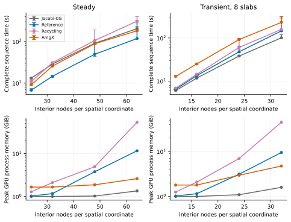
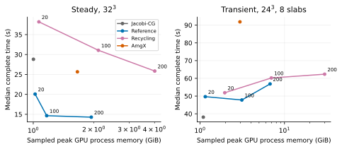
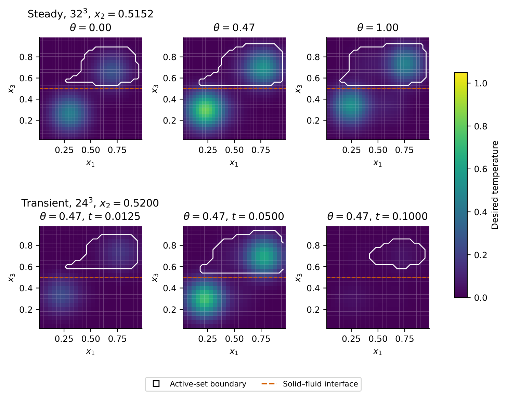

# Supplementary Cartesian figures

These figures belong to the first-implementation Cartesian comparisons of the
prescribed-flow CHT study, in which the reference is restricted on the host and
one total rank is shared by all slabs. The
[complete Cartesian records](../examples/cartesian_comparisons/README.md) hold
every time, range and iteration count behind them, and the
[detailed supplementary tables](supplementary-tables.md) give the memory,
preparation and cost-component tables. The images are converted from the
manuscript figure files listed at the end of this page.

## Complete time and memory under spatial refinement

Spatial refinement changes complete time and process memory for rank-100
comparisons with matched warm starts. Points show median complete times; bars
span all five repetitions. Memory values are the largest sampled process peaks
across repetitions and include library caches. Transient comparisons use eight
slabs at the fixed horizon `T_f = 0.1`.

## Complete time against memory across ranks

Complete time against sampled GPU process memory. Numerical labels give the
requested total rank for reference deflation and recycling; Jacobi-CG and AmgX
provide the complete-sequence controls. Each point summarizes five independently
timed, fully warm-started sequences.

## Cartesian target fields

Desired temperatures and active sets at PDAS convergence change across steady
queries and within a transient trajectory. Colors show desired temperature, white
contours enclose active DOFs, and the dashed line marks the solid--fluid
interface. Each panel uses the indicated grid plane at
`x_2 = (floor(n_s/2)+1)/(n_s+1)`, with direct samples at interior nodes. The
steady panels use three queries; the transient panels use three time levels of
one complete query.

## Source files

| Image | Manuscript figure | SHA-256 of the manuscript figure |
| --- | --- | --- |
| `cartesian_spatial_time_memory.svg` | `figures/cht/spatial_time_memory.pdf` | `8c4c791345c141e8cf3e16471305f8893bf1fdb9d3021ad19a32f5c82ee95071` |
| `cartesian_rank_time_memory.svg` | `figures/cht/rank_time_memory.pdf` | `b134b4a4529b07ca0e7513978876caf02490c6e44b356dba60411e1edfaef59e` |
| `cartesian_targets_and_constraints.png` | `figures/cht/targets_and_constraints.pdf` | `4d6e66aab98b83d03da6e4ad1cebe9e81bc2a95f109aa17ad73735c11595ce80` |
