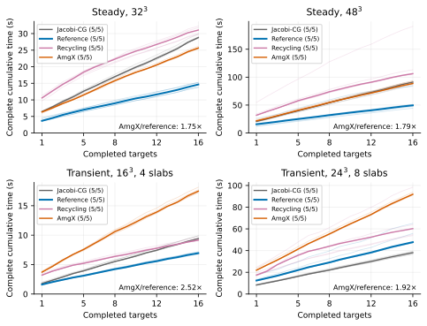
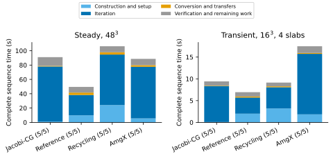

# Complete comparison details

These files preserve the detailed body-fitted tables and Cartesian performance
plots accompanying the manuscript. The shorter supporting information retains
every complete-time comparison, observed range and body-fitted GPU-memory peak.
No solver or unsuccessful comparison was excluded to shorten the presentation.

`primary.csv` contains the six primary body-fitted cases. `controls.csv` contains
the four rank and temporal controls. Both retain all four methods, all five timing
repetitions through their medians and ranges, iteration counts, and sampled host
and GPU memory. `manifest.json` identifies the original tables and checksums.
The [Cartesian tables](../cartesian_comparisons) retain their full original columns.

## Cartesian performance plots

Thin curves show all five independently timed 16-target sequences per method;
thick curves show pointwise medians. The endpoint includes cleanup. Ratios compare
median AmgX time with median reference time. Preparation-inclusive costs remain
in the [versioned supplementary tables](../../docs/supplementary-tables.md).

The components describe the actual median-time repetition of each method, so
they sum to that repetition's complete time. Construction and setup include
assembly, reference or resource creation, basis processing and coarse or hierarchy
setup. The remaining interval includes verification, outer updates,
synchronization and cleanup. `figures.json` identifies the unchanged source plots.

The [reference-policy study](../../docs/reference-policy-study.md) and
[mesh examples](../../docs/mesh-showcases.md) provide the configurations, raw
records and reproduction commands for the measured implementations. Numerical
sources remain distinct from the recommended guarded solver.
