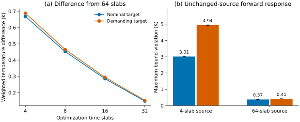

# Development studies and pilot outcomes

These studies support method development and model checks. Their detailed
results, configurations and figures are repository-only; they are separate
from the manuscript's completed benchmark comparisons. Every selected case,
failed attempt and earlier resolution cap remains available.

The manifest identifies the former manuscript source and checksums of the
relocated tables, temporal discussion and figure generator. The archived TeX
files preserve that version's wording and cross-reference labels; they are
source records rather than a standalone document.

## Construction and stopping pilots

All eight comparisons request rank 100. Each fixes its target population,
bound, starting active set, residual-refresh interval and cached-product policy.
The [configuration rows](sources/pilot_protocol_rows.tex) give those quantities,
the original-residual tolerance and the internal stopping margin. AmgX uses
internal margin 0.1. The [outcome rows](sources/pilot_outcome_rows.tex) and
[`studies.json`](studies.json) retain every comparison.

| Case | Jacobi-CG | Reference | Recycling | AmgX |
| --- | --- | --- | --- | --- |
| P1 | 0/1; — | 0/1; — | 0/1; — | 0/1; — |
| P2 | 0/1; — | 1/1; 23.837 | 1/1; 49.430 | 1/1; 48.843 |
| P3 | 1/1; 41.864 | 1/1; 23.306 | 1/1; 62.818 | 1/1; 47.850 |
| P4 | 0/1; — | 0/1; — | 0/1; — | 1/1; 40.127 |
| P5 | 0/1; — | 1/1; 38.855 | 1/1; 47.557 | 1/1; 81.159 |
| P6 | 1/1; 19.228 | 1/1; 25.017 | 1/1; 34.341 | 1/1; 47.434 |
| P7 | — | 3/3; 1.163 | — | — |
| P8 | — | 3/3; 1.165 | — | — |

Each cell gives completed/attempted sequences and the median complete time in
seconds for completed sequences. A dash supplies no completed-solve timing.
P7 and P8 contain only the two reference constructions, respectively.

P1 reaches the inner cap for all three CG methods and fails AmgX's independent
residual check. P2 starts with all constraints active; its Jacobi sequence
contains capped solves. P3 increases the refresh interval and all four sequences
meet the residual and optimality criteria. P4 changes the original-residual
target to `1e-9`; the three CG optimizers cycle under the unchanged outer
optimality criterion. P5 rejects one Jacobi solve whose fresh residual exceeds
`1e-10` by approximately `1.5e-15`. P6 uses internal margin 0.1 and cached
products; all four methods complete the comparison.

P7 and P8 compare mode-dependent and shared temporal factors on four-target
`8³ × 8` trajectories with three repetitions. Their nearly equal times establish
no measured advantage of mode dependence at that resolution. A separate
four-target bore-in-block construction control similarly gives 69.6 and 69.1 s.
The completed benchmark campaign fixes mode-dependent compression.

The [reference-policy guide](../../docs/reference-policy-study.md) supplies the
source-specific commands and the `reference-policy-data-v1` evidence checkout.
The [mesh guide](../../docs/mesh-showcases.md#rebuild-the-comparison-artifacts)
identifies the separate `mesh-cht-data-v1` construction records and commands.

## Original finer-transformer attempts

The [eight original outcome rows](sources/finer_outcomes.tex) preserve all four
methods for steady and four-slab problems with four targets each. Four
method/form combinations finish all targets. The others retain their
breakdown, iteration-cap or original-residual failure status. An incomplete
sequence's elapsed time is work through termination, not a completed-solve time.

The [scalar diagnostics](../../docs/supplementary-tables.md#finer-transformer-diagnostics)
identify residual gaps and loss of coarse orthogonality with positive curvature
and retained rank. These original attempts motivated the
[verified residual-correction procedure](../../docs/mesh-showcases.md#finer-transformer-residual-correction).
Its completed comparisons and the [guarded follow-up](../guarded_refinement)
have their own numerical sources and timing records.

## Temporal-resolution pilot

The [paired temporal example](../temporal_resolution/records.md) retains all
twenty optimization attempts, the unchanged-source forward replays and every
refinement stage. The separate half-divergence formulation removes the interior
energy contribution from discrete velocity divergence. This is a standard
transport form; see [Churbanov and Vabishchevich (2012)](https://arxiv.org/abs/1208.5649).
It changes the thermal discretization and supplies no replacement for the
original timing evidence.



The left panel uses linear temporal reconstruction and axisymmetric lumped-mass
weights to compare optimized states with 64 slabs. The right panel gives the
maximum bound violation at 65536 forward steps. Whiskers show the maximum
temperature change from 32768 steps, a temporal-sensitivity indicator.
All four final replays meet the two-consecutive-grid 0.05 K criterion. The
remaining bound violations are reported independently of that criterion.

To regenerate the compact figure and its numerical summary from this checkout:

```bash
uv sync --frozen --extra study --extra plot
uv run --frozen python tools/reproduce_development_studies.py \
  --output runs/development-studies
```

The output includes `figures/temporal/resolution.pdf` and its numerical summary.
The paired temporal example provides the commands for rerunning the optimized
controls and the full forward-resolution diagnostics. No control is modified
or temperature clipped during a replay.
